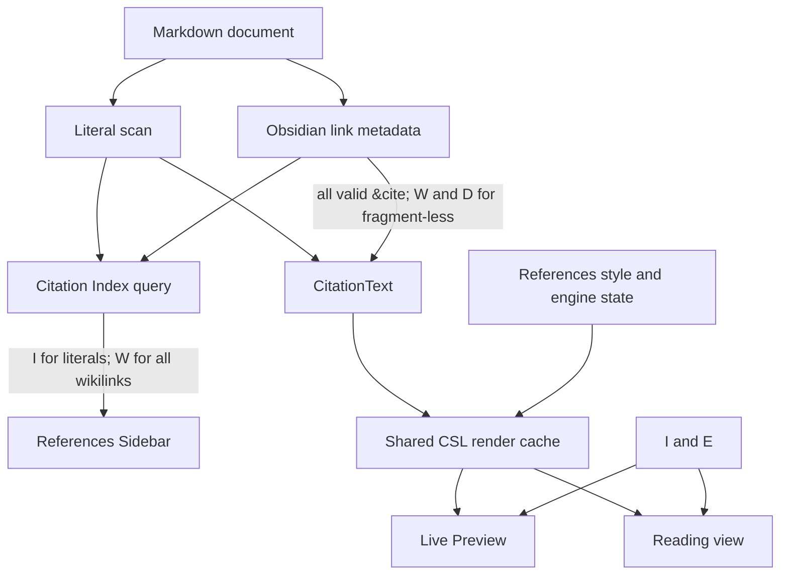

# Citation settings and rendering semantics

Research date: 2026-08-09

Repository state: `5920c207` (`feat/pandoc-ref`)

## Result

The current settings do not define one citation set for all consumers. The
References Sidebar and the in-text renderer apply different predicates to
Literature Note wikilinks. A numeric CSL style can therefore give one work a
different number in Live Preview or Reading view and in the sidebar.

The highest-impact default case is a valid `#cite:` wikilink. It is always sent
to the in-text renderer, but it is sent to the sidebar only when **Wikilink
citations** is on. That setting is off by default. For this source:

```markdown
[[Beta#cite:locator=3]] then [@alpha]
```

the in-text renderer receives Beta, then Alpha. A numeric style can render
Alpha as `[2]`. The sidebar receives only Alpha and can mark it `[1]`. This is a
source-based inference from verified component behavior: `CitationText`
includes the explicit link and preserves document order; the sidebar removes
all wikilinks when its toggle is off; and the engine numbers a complete request
in request order ([CitationText tests](../../apps/obsidian/src/services/citation-text/service.test.ts#L245-L328),
[References view](../../apps/obsidian/src/views/references/view.tsx#L184-L244),
[engine test](../../apps/obsidian/src/services/pandoc/engine.test.ts#L285-L299)).

Use one ordered citation set for the sidebar and in-text rendering. Treat
literal Pandoc syntax and valid `#cite:` links as citations by definition. Use
one opt-in setting for fragment-less Literature Note links. Make indexing an
internal service. Keep presentation and navigation as separate choices.

## Method and scope

This report uses first-party sources only: ZotLit source, tests, documentation,
Git history, issue [#642](https://github.com/aidenlx/zotlit/issues/642), and
official Obsidian documentation. The focused ZotLit suites for the citation
index, citation text, Pandoc engine, and editor and Reading-view services pass:
6 files and 109 tests.

Obsidian defines Live Preview and Source mode as two editing modes. Live Preview
shows rendered Markdown in the editor and reveals syntax around the cursor
([Obsidian Help](https://help.obsidian.md/Live%2Bpreview%2Bupdate)). ZotLit uses
CodeMirror marks and replace decorations for these modes. This is the official
extension mechanism for styling or replacing editor text
([Obsidian decorations documentation](https://docs.obsidian.md/Plugins/Editor/Decorations)).

## Current settings inventory

The defaults come from the settings schema. The labels and descriptions come
from the English message source and the Citations settings page
([schema](../../apps/obsidian/src/services/settings/schema.ts#L65-L126),
[messages](../../messages/en.json#L281-L321),
[settings page](../../apps/obsidian/src/setting-tab/citations.ts#L16-L94)).

| UI label | Key or state | Default | Actual effect on the evaluated surfaces |
| --- | --- | --- | --- |
| Citation suggester | `citation.editor-suggester` | On | Insertion suggestions only. |
| `@` trigger | `citation.at-trigger` | Off | An additional suggester trigger only. The row is visible only while the suggester is on. |
| Show citation key in suggestions | `citation.show-citekey-in-suggester` | Off | Suggestion-row text only. |
| Citation key indexing | `citation.citekey-indexing` | On | Enables literal-citekey scanning and literal entries in the sidebar. It is also a prerequisite for the literal editor and Reading-view treatment. It does not stop the Zotero citekey resolution snapshot or wikilink queries. |
| Wikilink citations | `citation.wikilink-citations` | Off | Includes Literature Note wikilinks in the sidebar. Together with the next setting, it also makes fragment-less links part of in-text citation rendering. It does not gate valid `#cite:` rendering. |
| Show wikilink citations as citation text | `citation.wikilink-display` | On | With **Wikilink citations**, replaces fragment-less Literature Note links in Live Preview and Reading view. The row is hidden while **Wikilink citations** is off, but its stored default remains on. |
| Citation key styling | `citation.citekey-editor` | On | With indexing, enables Source-mode marks, Live Preview replacement, Reading-view replacement, click navigation, hover, open-or-create, and palette commands for literal citekeys. |
| References style | `citation.references-style` | Built-in Chicago author-date | Selects the CSL style for sidebar bibliography entries and all formatted in-text citations. |
| Pandoc engine | Device-wide install state | Absent until installed | When installed, formats both bibliography entries and in-text citations. Without it, surfaces use item-summary fallbacks. The current description mentions references and exports, but not in-text citations. |
| Pandoc integration pair | Action, no setting key | None | Saves export integration files. It has no editor, Reading-view, or sidebar effect. |
| Reset citation index | Diagnostics action | N/A | Clears stored literal scans and starts a rebuild. It does not change vault files ([Diagnostics action](../../apps/obsidian/src/setting-tab/diagnostics.ts#L90-L123)). |

## Exact current behavior

Use these symbols:

- `I`: **Citation key indexing**
- `E`: **Citation key styling**
- `W`: **Wikilink citations**
- `D`: **Show wikilink citations as citation text**

### Citation membership by consumer

| Source syntax | Stored literal index | References Sidebar | `CitationText` input for Live Preview and Reading view |
| --- | --- | --- | --- |
| Literal `@key` or `[@key]` | `I` | `I` | `I` |
| Valid Literature Note `#cite:` link | Never; derived from Obsidian metadata | `W` | Always |
| Fragment-less Literature Note link | Never; derived from Obsidian metadata | `W` | `W && D` |

The index stores only literal scans. It derives wikilinks from Obsidian's
metadata cache when a caller asks for them. Turning `I` off clears literal
scans in memory, but `getCitations()` can still return wikilinks
([Citation Index](../../apps/obsidian/src/services/citation-index/service.ts#L127-L150),
[setting application](../../apps/obsidian/src/services/citation-index/service.ts#L501-L529),
[test](../../apps/obsidian/src/services/citation-index/service.test.ts#L522-L548)).

`CitationText` uses `W && D` only for fragment-less links. Its citation parser
lets a valid fragment pass without that condition. It then merges wikilink and
literal sources in document order and sends the complete list to the engine
([wikilink predicate](../../apps/obsidian/src/lib/wikilink-citation.ts#L87-L117),
[setting tracker](../../apps/obsidian/src/lib/wikilink-citation.ts#L225-L248),
[merge and render](../../apps/obsidian/src/services/citation-text/service.ts#L245-L299)).

### Literal citations

| `I` | `E` | Sidebar | Source mode | Live Preview | Reading view |
| --- | --- | --- | --- | --- | --- |
| Off | Either | Absent | Raw, no ZotLit mark or navigation | Raw | Raw |
| On | Off | Present | Raw, no ZotLit mark or navigation | Raw | Raw |
| On | On | Present | Raw text with resolved or unresolved link styling; modifier navigation and hover | Formatted citation or summary fallback away from the selection; raw source on selection; navigation | Formatted citation or summary fallback; navigation |

The same predicate, `I && E`, registers the literal CodeMirror extension and
enables the Reading-view post-processor
([editor gate](../../apps/obsidian/src/services/citekey-editor/service.ts#L180-L202),
[Reading-view gate](../../apps/obsidian/src/services/citekey-reading/service.ts#L104-L126)).
Live Preview alone creates replace widgets; Source mode keeps marks over the
raw text ([editor extension](../../apps/obsidian/src/services/citekey-editor/extension.ts#L269-L304),
[decoration build](../../apps/obsidian/src/services/citekey-editor/extension.ts#L412-L476)).

### Literature Note wikilinks

Source mode always keeps the raw wikilink. ZotLit still adds the public
`zt-literature-note-link` identity mark to each resolved Literature Note link.
The extension is installed even when `W` and `D` are both off because valid
`#cite:` links bypass those settings
([service](../../apps/obsidian/src/services/wikilink-editor/service.ts#L36-L46),
[extension](../../apps/obsidian/src/services/wikilink-editor/extension.ts#L200-L272),
[registration test](../../apps/obsidian/src/services/wikilink-editor/service.test.ts#L71-L84)).

| Link kind and settings | Sidebar | Source mode | Live Preview and Reading view |
| --- | --- | --- | --- |
| Valid `#cite:`, `W` off | Absent | Raw wikilink plus identity hook | Formatted citation or Citation Display Text fallback |
| Valid `#cite:`, `W` on | Present | Raw wikilink plus identity hook | Formatted citation or Citation Display Text fallback |
| Fragment-less, `W` off | Absent | Raw wikilink plus identity hook | Native Obsidian link display |
| Fragment-less, `W` on and `D` off | Present | Raw wikilink plus identity hook | Native Obsidian link display |
| Fragment-less, `W` on and `D` on | Present | Raw wikilink plus identity hook | Formatted citation or Citation Display Text fallback |

The Reading-view tests prove that a fragment renders with both toggles off and
that a fragment-less link needs `W` with the default `D`
([Reading-view tests](../../apps/obsidian/src/services/wikilink-reading/service.test.ts#L173-L224)).

### Style and engine

`citation.references-style` invalidates both bibliography and in-text render
caches. A database change, engine change, or Zotero path change does the same.
The cache returns `null` when the engine is absent
([render cache](../../apps/obsidian/src/services/pandoc/render-cache.ts#L52-L64),
[citation rendering](../../apps/obsidian/src/services/pandoc/render-cache.ts#L121-L150),
[invalidation](../../apps/obsidian/src/services/pandoc/render-cache.ts#L160-L206)).
Surfaces then replace resolved keys with item summaries and keep the source
punctuation, prefixes, and locators. An entirely unresolved citation stays raw
([presentation fallback](../../apps/obsidian/src/services/citation-text/present.ts#L25-L90)).

## Implicit coupling and side effects

### 1. Two citation universes can change numeric meaning

The two mismatches are symmetrical:

1. `W = false`: a valid `#cite:` link participates in in-text numbering but is
   absent from the sidebar.
2. `W = true, D = false`: a fragment-less link participates in sidebar order
   and markers but is absent from in-text numbering.

This is a correctness problem. It is not only a display preference. Numeric
styles assign numbers across the full request, and the engine test confirms
that request order controls `[1]`, `[2]`, and later reuse.

### 2. “Citation key styling” owns three axes and two view types

`E` owns presentation, navigation, and command availability. It also controls
Reading view although it is under the **Editor** heading. A user who wants raw
Source-mode text without link behavior also loses formatted Live Preview and
Reading view. A user who disables navigation also loses rendering.

The migration makes this coupling more important. The retired **Citation Key
Links** value moves directly into `citation.citekey-editor` to preserve a click
preference. A former navigation opt-out can therefore disable current
presentation and Reading-view behavior
([migration](../../apps/obsidian/src/services/settings/migrate.ts#L281-L302),
[migration tests](../../apps/obsidian/src/services/settings/migrate.test.ts#L415-L457)).

### 3. Enabling wikilink membership also enables display by default

`D` defaults on and is hidden while `W` is off. Turning `W` on therefore makes
two changes at once: links enter the sidebar, and fragment-less links start to
render in Live Preview and Reading view. The UI does not ask for the second
choice at that time.

### 4. Names understate effects

- **Citation key indexing** is a literal-syntax switch, not a switch for the
  full Citation Index. Resolution and wikilink query behavior remain active.
- **References style** formats in-text citations too.
- **Pandoc engine** install and uninstall change in-text rendering, although
  its description names references and exports.
- Valid `#cite:` rendering and the Literature Note theme hook are unconditional
  behaviors, not visible settings.

## Data and control flow



The divergence occurs before rendering. The sidebar and `CitationText` build
different ordered inputs from the same document. A shared render cache cannot
repair that difference.

## Issue #642 assessment

Issue [#642](https://github.com/aidenlx/zotlit/issues/642) specified a shared,
vault-wide Citation Index for the sidebar, Live Preview, and Reading view. It
also specified these points:

- Citekey Indexing is on by default. Wikilink Citations is opt-in.
- A user can disable editor treatment while keeping indexing on (user story
  16).
- A valid Citation Fragment displays regardless of wikilink settings.
- one References Style governs sidebar and in-text rendering (user story 28).
- navigation sits under indexing and the editor toggle; the design adds no new
  navigation setting.

The implementation meets the shared-index and style-reuse goals. It also
implements the valid-fragment exception. The exception is applied in the
display pipeline but not in sidebar membership, which creates the primary
mismatch. The literal editor opt-out exists, but it also disables Reading view
and navigation. Thus it is broader than an editor-treatment preference.

## Redesign options

| Option | Result | Assessment |
| --- | --- | --- |
| Change labels and descriptions only | Makes current coupling more visible. | Low migration cost. It does not fix the two citation universes or numeric mismatch. |
| Add a toggle for every syntax, surface, and interaction | Gives exact control for Source mode, Live Preview, Reading view, sidebar, and navigation. | It can preserve all current combinations. It creates many states and makes cross-surface consistency difficult to explain and test. |
| Define citation membership by syntax semantics, then apply independent presentation and navigation choices | Gives one ordered citation set to every consumer. Keeps user choices aligned to one axis each. | Recommended. It fixes the correctness problem and gives the smallest stable model. |

## Recommended target model

### Membership

Define one ordered `CitationSet(document)`:

1. all recognized literal Pandoc citations;
2. all valid Literature Note `#cite:` links; and
3. all fragment-less Literature Note links only when **Treat Literature Note
   links as citations** is on.

The sidebar and the full-document in-text render must use this exact set. A
presentation setting must not add or remove members. This invariant keeps
numeric assignment, disambiguation, and bibliography markers consistent.

Make literal scanning an internal, always-on implementation detail. Keep
**Reset citation index** in Diagnostics. The index is derived data, performs an
idle backfill, scans the active document on demand, and already defaults on as
the zero-setup design of #642 intended.

### Presentation

Use one optional setting with an exact outcome, for example:

> **Show formatted citations** — Show citations in Live Preview and Reading
> view with the selected citation style. Source mode always shows Markdown.

This setting applies to all citation syntaxes. When it is off, it changes only
presentation. `CitationSet` and sidebar membership stay unchanged. Source mode
can always keep raw text with a semantic mark; this is recognition, not
replacement.

Rename **References style** to **Citation and references style**, or **Citation
style**, and state that it applies to Live Preview, Reading view, and the
sidebar. Update the engine row to state that the engine formats citations,
references, and exports.

### Navigation

Navigation can be inherent. If an opt-out is required, use one separate setting:

> **Open citations as links** — Enable click, hover preview, open-under-cursor
> commands, and open-or-create behavior.

This setting changes interaction only. It does not change styling, formatted
text, membership, or numbering. Keeping this control is useful because the old
**Citation Key Links** setting proves that users had a navigation choice, and
it provides a correct migration target.

This model does not keep #642 user story 16's per-syntax editor opt-out. Full
compliance needs separate presentation controls for literal and wikilink
syntax. That control has a high state cost. Prefer one consistent presentation
choice unless current user evidence shows a need for per-syntax controls.

## Migration considerations

An exact migration to the minimal model is impossible for every stored state.
The current model permits literal rendering off while valid `#cite:` rendering
stays on, and permits sidebar wikilink membership while fragment-less in-text
rendering stays off. One global presentation setting cannot preserve those
combinations.

Use this semantic migration:

| Current key | Target | Migration |
| --- | --- | --- |
| `citation.wikilink-citations` | `citation.fragmentless-wikilinks` | Copy the value. The new key controls membership everywhere. |
| `citation.wikilink-display` | `citation.formatted-display` | Do not copy it alone. It was syntax-specific and conditional. Use it only as one input to an explicit compatibility decision. |
| `citation.citekey-editor` | `citation.navigation` | Copy for navigation. If raw v3 `citation.key-links` is still available during migration, map that value directly instead. |
| `citation.citekey-indexing` | Internal index | Remove for new installs. See the compatibility case below for stored `false`. |
| `citation.references-style` | Renamed style key or same stored key | Preserve the selected style ID exactly. |

For a released build, use a one-version compatibility bridge:

1. Preserve existing rendering behavior with hidden legacy predicates.
2. Show the new settings for new installs and after the user makes an explicit
   choice.
3. Explain the semantic change in the release note.
4. Remove the hidden predicates in the next settings-schema version.

A stored `citation.citekey-indexing = false` is the hard case. Always-on literal
membership changes sidebar output for that user. If strict behavior preservation
is required, keep a temporary advanced **Include literal Pandoc citations**
compatibility flag. It conflicts with the target rule that literal syntax is a
citation, so it must have a stated removal plan.

If these settings have not shipped, migrate directly to the semantic model and
do not preserve the intermediate combinations.

## Evidence gaps and required acceptance tests

- No current end-to-end test asserts the sidebar number against the rendered
  in-text number. The mismatch follows from tested inputs and tested engine
  numbering. Add the two worked cases from this report as integration tests.
- This research did not drive a live Obsidian window. Existing unit tests prove
  service and DOM behavior. A runtime check must cover Source mode, Live
  Preview, Reading view, selection reveal, and an installed numeric style.
- The correct migration depends on whether each settings-schema version has
  shipped and whether raw v3 data can still be observed. Confirm the release
  boundary before implementation.
- Themes can give the unconditional Literature Note identity hook a visible
  style. Verify the public theme-hook contract if the target model changes when
  marks are added.

The most important acceptance invariant is simple: for one document and one
style, every citation-aware surface receives the same ordered `CitationSet`.
